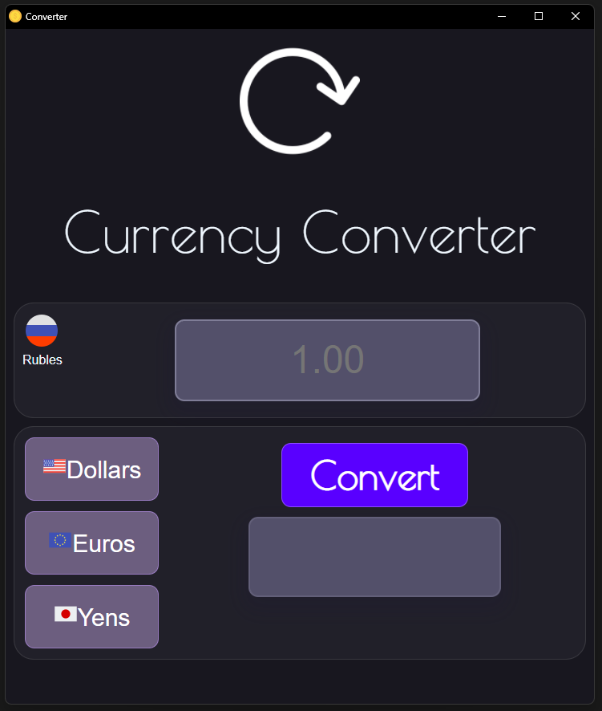
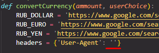

## 💵 Currency converter web app
  
Using eel python library to display information in web interface and
Beautiful Soup for Google page parsing.
Eel helps to use python's logic in HTML
All data of exchange rates is getting from Google search page

---
## How to use
1. **Get your User-Agent:** type *Get user agent* in Chrome
2. Copy your Agent to main.py to *headers = {'User-Agent': ''}*
    
3. Save changes and **start main.py**

